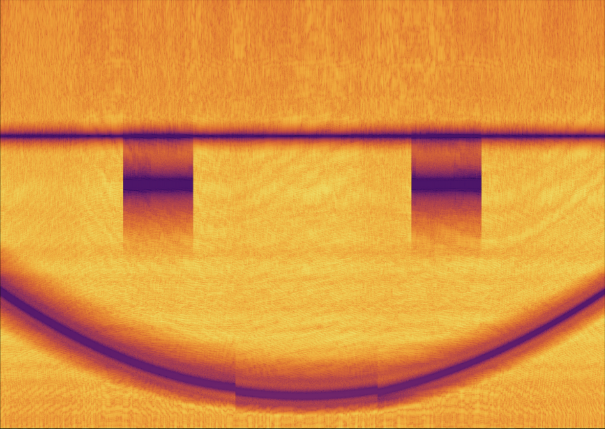

# :ice_cube: Filtering Noise from Ice Sheets using Dynamic Bandstop Filters :ice_cube:

<h1> Team Members </h1>
- Naomi Mo  
- Didi Kamalova  
- Caleb Matthews  
- Anabella Hernandez  

<h1> Results </h1>
In order to maximize our SNR, we combined our most successful filters, in order to eliminate the parabola-esque curve, as well as the eye patches. To achieve this, we added our three-segment parabolic-arc bandstop filter and our time-triggered eyepatch bandstop filter together in the iterator. We ran each segment of data first through the parabolic bandstop and then through the eyepatch filter (if active) before moving to the next time slice. This methodology proved very effective, yielding an SNR of 36.20 dB.  

By adding further optimizations, such as additional bandstop filters across certain frequencies with higher spectral density (an example if shown in figure 14), as well as experimenting with elliptic filters with extremely high stop band attenuation, we achieved an even higher SNR: 36.36 dB.

  

  

